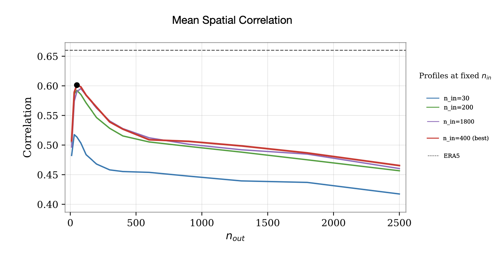
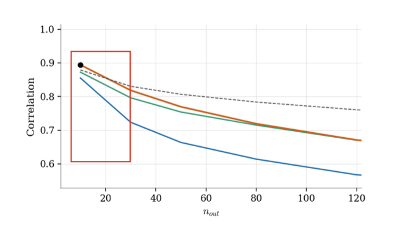

# Precip-ML
Machine-learning-based reconstruction of daily precipitation from large-scale atmospheric fields

## Scientific motivation & context

Accurately representing daily precipitation remains one of the major challenges in global climate modeling. The coarse spatial resolution of Global Climate Models (GCMs) and their reliance on parameterized convection schemes limit their ability to capture the fine-scale variability of rainfall. As a result, precipitation fields often exhibit substantial biases and lack realistic spatial structure, particularly at regional scales where local processes such as orography, land–sea contrasts, and mesoscale dynamics play a dominant role.

By contrast, large-scale atmospheric variables—such as wind, pressure, temperature, and humidity—are generally more reliably simulated, as they are strongly constrained by observations and governed by large-scale dynamical processes. This imbalance highlights a fundamental limitation of climate models: while the large-scale circulation of the atmosphere is reproduced with reasonable fidelity, its translation into local precipitation patterns remains highly uncertain.

Traditional approaches to address this issue include bias correction techniques and dynamical downscaling using regional climate models (RCMs). Bias correction methods are computationally inexpensive but rely on strong assumptions about the stationarity of model biases, while dynamical downscaling is computationally expensive and inherits errors from the driving global model. In this context, empirical and machine-learning-based downscaling methods offer a complementary approach. By learning the statistical relationship between large-scale atmospheric predictors and observed precipitation, these methods aim to reconstruct more realistic precipitation fields while maintaining physical consistency with the large-scale circulation. This project explores such an approach by combining dimensionality reduction techniques and supervised machine learning to reconstruct daily precipitation over the Mediterranean region from large-scale atmospheric fields.

## Objectives and research questions

The overall goal of this project is to investigate whether daily precipitation at regional scale can be reconstructed from large-scale atmospheric circulation using supervised machine-learning techniques. Rather than focusing on a single predictive setup, the work aims to explore different modeling strategies and assess their robustness and limitations.

The project is guided by the following research questions:

1. To what extent can large-scale atmospheric fields be used to reconstruct the spatial and temporal variability of daily precipitation at regional scale?

2. How does the predictive skill depend on the dimensionality of the input representation, and what trade-offs emerge between information content and model complexity?

3. How sensitive is precipitation reconstruction to the choice of atmospheric predictors and feature selection strategies?

4. What is the predictive performance of the model when precipitation is represented in a reduced EOF space, and how does this representation affect reconstruction accuracy and spatial consistency?

5. Can a machine-learning-based reconstruction outperform direct precipitation estimates provided by large-scale atmospheric models?

By addressing these questions, the project aims to provide insights into the potential and limitations of machine-learning-based downscaling approaches for precipitation, with particular attention to robustness, interpretability, and applicability to climate-impact studies.

## Method overview

The methodological workflow of the project is summarized in the figure below, which illustrates the full training pipeline and the two modeling strategies considered.

The input to the model consists of large-scale atmospheric predictors drawn from the ERA5 reanalysis. These predictors include key dynamical and thermodynamical variables describing the atmospheric state and are defined on a regular latitude–longitude grid. ERA5 is used as a source of physically consistent large-scale circulation fields, which are generally more reliable than model-based precipitation estimates.

To reduce dimensionality and retain the dominant modes of variability, each predictor field is transformed using principal component analysis (PCA). A fixed number of leading principal components (PCs) is retained for each variable. The PCA decomposition is computed using the training set only, and the resulting transformation is consistently applied to validation and test data.

The retained PCs from all predictors are concatenated to form the input feature vector of the model. A fully connected neural network (multilayer perceptron, MLP) is then trained to learn the relationship between the large-scale atmospheric state and daily precipitation. The MLP is chosen for its simplicity and suitability as a baseline nonlinear model.

The target variable is provided by the CPC observational precipitation dataset, which offers gauge-based daily precipitation estimates defined on the same spatial grid as the predictors. The analysis is restricted to land grid points, where ground-based observations are available and physically meaningful.

Two complementary output strategies are investigated:

**Approach 1 – Full-field reconstruction.**  
In the first approach, the network directly predicts the full precipitation field, represented as a flattened array of grid-point values. The output vector is subsequently reshaped onto the original latitude–longitude grid to obtain a spatial precipitation map.

**Approach 2 – Reduced-space reconstruction.**  
In the second approach, the network predicts a reduced set of principal components describing the precipitation field in a low-dimensional space. These precipitation PCs are then combined with the corresponding EOF spatial patterns—computed from the training data—to reconstruct the full precipitation field. This strategy constrains the prediction to a physically meaningful subspace and allows for a controlled trade-off between dimensionality reduction and reconstruction accuracy.

Both approaches are evaluated within the same training and validation framework, enabling a direct comparison of their predictive performance, robustness, and sensitivity to the chosen output representation.

## Repository structure

- `src/`: core reusable modules (data loading, EOF/PCA utilities, model definition, training, inference, metrics, and plotting).
- `scripts/`: entry points to run experiments and standard workflows (typically driven by YAML configs).
- `experiments/`: YAML configuration files defining predictors, number of PCs, training settings, and output strategy.
- `thesis_experiments/`: thesis-oriented analyses and figure generation scripts (plotting and post-processing).
- `results/`: output artifacts such as figures and metric tables.
- `docs/figures/`: figures used in the `README`.

## Results (with code references)

### Predictor selection and redundancy

Configuration experiments show that increasing the number of atmospheric predictors does not systematically improve model performance. In several cases, adding upper-tropospheric or highly correlated variables leads to a degradation of skill, highlighting the detrimental effect of predictor redundancy.

Variables directly linked to large-scale ascent, moisture availability, and low-level circulation consistently contribute positively, indicating that the model exploits physically meaningful drivers of precipitation while being sensitive to collinearity among inputs.

*Generated by:* `thesis_experiments/plot_01_fields_configs_n1000.py`

### Sensitivity to number of input PCs

Model performance exhibits a strong dependence on the number of retained input principal components. Across both modeling strategies, skill increases rapidly at low dimensionality and peaks consistently around 400–500 input PCs.

Beyond this range, additional components mainly represent small-scale or noisy structures that increase dimensionality without improving predictive power, resulting in a slight but systematic degradation across metrics.

*Generated by:* `thesis_experiments/03_fields_tuning_ninput_config8_OFFLINE.py` and `thesis_experiments/plot_03_tuning_ninput_config8.py`

### Sensitivity to number of output PCs (Approach 2)

When precipitation is represented in a reduced EOF space, model performance depends critically on the number of retained output PCs. High predictive skill is achieved for a limited number of leading modes, while performance deteriorates when higher-order, weakly predictable modes are included.

The optimal trade-off between retained variance and predictability is found at intermediate output dimensionality, with approximately 50 output PCs yielding the best agreement with observations.

*Generated by:* `thesis_experiments/05_pcs_output_profiles_plots.py`

### Low-dimensional precipitation reconstruction (Approach 2)

The low-dimensional reconstruction strategy achieves its best performance when predicting a limited number of precipitation PCs and subsequently reconstructing the full field. In this regime, the model captures the dominant precipitation patterns while avoiding instability associated with noise-dominated modes.

Under the optimal configuration, the reconstructed fields slightly outperform the direct full-field approach, indicating that constraining the prediction to a physically meaningful low-dimensional subspace improves robustness.

*Generated by:* `thesis_experiments/05_pcs_output_profiles_plots.py`

Additional diagnostic plots and full-resolution outputs are generated by the scripts in `thesis_experiments/` and saved in `results/`. These are not shown here to keep the README concise.
## Reproducibility and demo
Due to the size of the original datasets and licensing constraints, the full training pipeline cannot be reproduced out-of-the-box using this repository alone. In particular, the complete ERA5 and CPC netCDF files used for training and evaluation are not included.

Nevertheless, the repository is structured to ensure transparency and partial reproducibility of the workflow:

- **All figures shown in this README** are generated by scripts included in the repository and can be reproduced given access to the original datasets.
- **The core training, inference, and evaluation code** is fully available and documented in modular form, allowing users to reproduce the experiments with their own data sources.
- **Pretrained model weights** and lightweight example data may be added in the future to enable fully reproducible inference.

At its current stage, the repository is intended as a research codebase and methodological reference rather than a fully self-contained benchmark. Users interested in reproducing the experiments are encouraged to adapt the provided scripts and configuration files to their local data setup.

## Installation & requirements

## How to run

## Limitations and discussion

