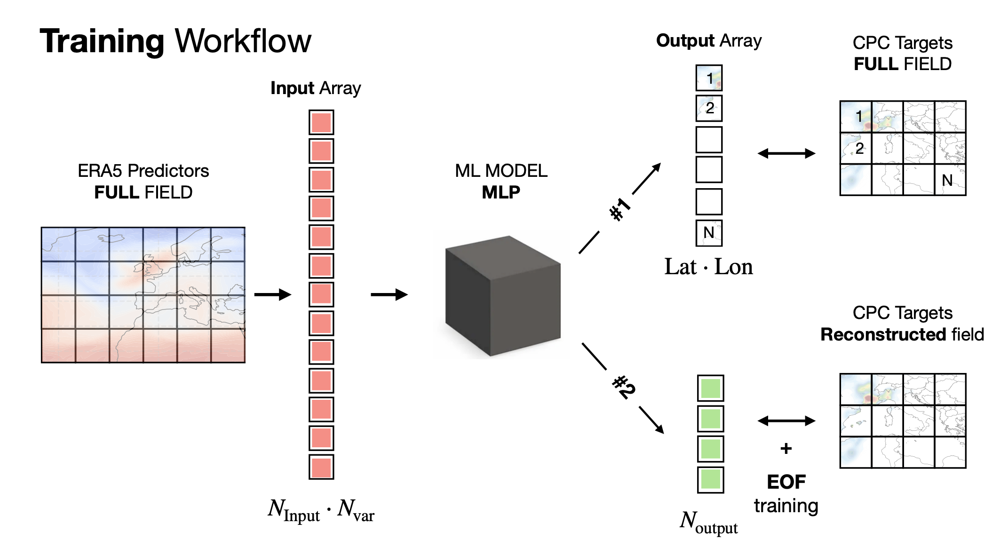
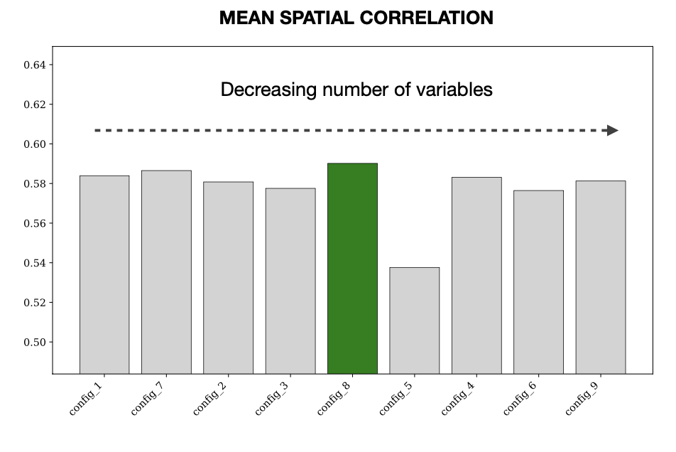
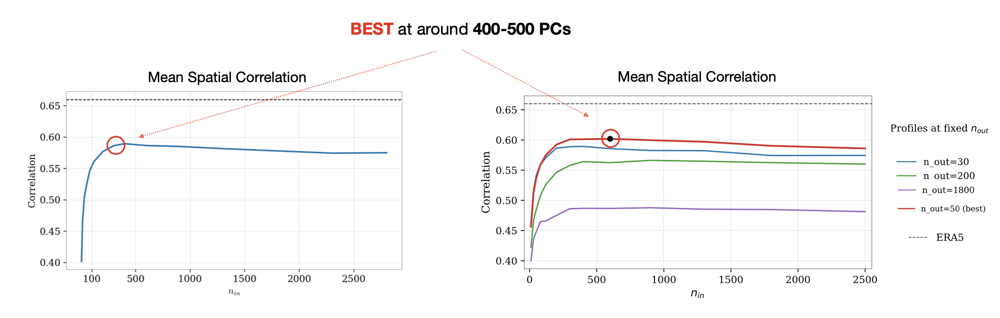

# Precip-ML  
Machine-learning-based reconstruction of daily precipitation from large-scale atmospheric circulation.

## Overview

Daily precipitation remains one of the most challenging variables to represent accurately in climate models. While large-scale atmospheric circulation is generally well simulated, its translation into realistic regional rainfall patterns remains highly uncertain.

This project develops a supervised machine-learning framework to reconstruct daily precipitation over the Mediterranean region from large-scale atmospheric predictors derived from ERA5 reanalysis. Observed daily precipitation from the CPC dataset is used as reference.

---

## Objectives

- Quantify how well large-scale atmospheric fields can reconstruct regional daily precipitation.
- Evaluate whether this ML-based reconstruction outperforms ERA5 precipitation.   
- Assess the impact of dimensionality reduction and the choice of the predictors on predictive skill and robustness.  
- Compare full-field prediction against reduced EOF-space reconstruction.

---

## Method Overview

The overall training workflow is illustrated below.

<p align="center">
  
</p>

The methodological pipeline consists of four main stages:

- **Predictors:** Large-scale atmospheric variables from ERA5 on a regular latitude–longitude grid.  
- **Dimensionality reduction:** Principal Component Analysis (PCA) applied to each predictor field (fitted on training data only).  
- **Supervised learning:** A multilayer perceptron (MLP) learns the mapping from atmospheric PCs to precipitation representation.  
- **Target:** CPC daily precipitation over land grid points.  

Two output strategies are investigated:

1. **Full-field prediction:** direct regression of precipitation at each grid point.  
2. **Reduced-space prediction:** regression of precipitation principal components followed by EOF-based reconstruction of the full field.  

Both approaches are evaluated within the same training and validation framework, enabling a direct comparison of their predictive performance, robustness, and sensitivity to the chosen output representation.

## Repository structure

```text
precip-ml/
├── src/                     # Core modules: data loading, EOF/PCA, model, training, inference, metrics, plotting
├── scripts/                 # Entry points to run experiments and standard workflows
├── experiments/             # YAML configs: predictors, number of PCs, training settings, output strategy
├── notebooks/               # Reproducible demo and analysis notebooks
├── thesis_experiments/      # Thesis-oriented analyses and figure generation scripts
├── results/                 # Generated figures and evaluation metric tables
└── docs/
    └── figures/             # Figures used in the README
```
## Installation

Create and activate the conda environment:

```bash
conda env create -f environment.yml
conda activate precip-ml
```

## Data

This project relies on external datasets that are not included in the repository due to size and licensing constraints.

### ERA5 Predictors

Large-scale atmospheric predictors are obtained from the ERA5 reanalysis dataset provided by the Copernicus Climate Data Store (CDS):

[https://cds.climate.copernicus.eu/](https://cds.climate.copernicus.eu/datasets/reanalysis-era5-single-levels?tab=download)

- Period: 1979–2020  
- Temporal resolution: daily means  
- Spatial resolution: 0.5° × 0.5°  
- Variables: large-scale dynamical and thermodynamical atmospheric fields  

---

### CPC Precipitation (Target)

Observed daily precipitation is taken from the CPC Global Unified Gauge-Based Analysis:

https://psl.noaa.gov/data/gridded/data.cpc.globalprecip.html

- Period: 1979–2020  
- Temporal resolution: daily  
- Spatial resolution: 0.5° × 0.5°  

---

### ERA5 Precipitation (Baseline Comparison)

ERA5 total precipitation at 0.5° resolution is used as baseline for comparison against the ML reconstruction.

---
## Quick Demo
A reproducible inference demo is provided in:

`
notebooks/01_demo_inference.ipynb
`

The notebook:

- Loads pretrained models
- Runs inference on the test period
- Reconstructs daily precipitation fields
- Computes evaluation metrics (e.g., spatial and temporal correlation)
- Produces precipitation maps, scatter plots, and regional analyses
- Compares the ML reconstruction against the ERA5 baseline
- 
---
## Reproducing the Experiments

The full pipeline consists of three main stages:

1. Compute EOF/PC representations  
2. Run model training and inference  
3. Generate evaluation figures and tables  

---

### 1. Compute ERA5 Predictor PCs

Compute EOFs and principal components for ERA5 predictors.

**Group A example:**

```bash
python -m scripts.compute_era5_pcs \
  --era5-dir <PATH_TO_ERA5_DATA> \
  --out-dir <PATH_TO_OUTPUT_EOF_PICKLES> \
  --group A \
  --pattern "ERA5_{var}_r720x360_1979-2023_src.nc" \
  --end 2020-12-31 \
  --N 8000 \
  --zpc \
  --verbose
```

**Group B example:**

```bash
python -m scripts.compute_era5_pcs \
  --era5-dir <PATH_TO_ERA5_DATA> \
  --out-dir <PATH_TO_OUTPUT_EOF_PICKLES> \
  --group B \
  --pattern "ERA5_{var}_r720x360_1979-2020_regrid_daymean.nc" \
  --end 2020-12-31 \
  --N 8000 \
  --zpc \
  --verbose
```

---

### 2. Compute CPC Precipitation PCs

```bash
python -m scripts.compute_cpc_pcs \
  --cpc-file <PATH_TO_CPC_FILE> \
  --out-dir artifacts/cpc_pickles \
  --var pr \
  --start "1979-01-01T12:00:00.000000000" \
  --end "2020-12-31T12:00:00.000000000" \
  --N 2800 \
  --zpc \
  --verbose
```

---

### 3. Configure the Experiment

Experiments are defined via YAML configuration files located under:

```
experiments/
```

Each configuration file specifies:

- Selected predictor variables  
- Number of retained input PCs  
- Target representation (`fields` or `pcs`)  
- Number of output PCs (if applicable)  
- Temporal range and train/validation/test splits  

---

### 4. Run Training and Inference

Example minimal launch:

```bash
python -m scripts.run_experiment \
  --config configs/exp01.yaml \
  --dir-data <PATH_TO_DATA> \
  --dir-eof <PATH_TO_ERA5_EOF_PICKLES> \
  --cpc-pcs-pickle <PATH_TO_CPC_PCS_PICKLE>
```

Each run generates an experiment folder containing:

- Saved model  
- Training history  
- Configuration file  
- Predictions on training and validation subsets  

---

### 5. Generate Figures and Tables

Additional thesis-oriented analyses and figure generation scripts are located under:

```
thesis_experiments/
```

These scripts reproduce:

- Configuration comparison plots  
- Histogram comparisons (ML vs ERA5)  
- Field reconstruction tuning experiments  
- PC profile analyses  
- Metric tables exported from pickle artifacts  

Generated figures and tables are stored under:

```
results/
```
---
## Results

The figures below illustrate **two representative examples** of the analyses performed in this project.  
They are intended to provide an overview of the modeling behavior; additional experiments and full diagnostic outputs are available under `thesis_experiments/` and `results/`.

---

### Predictor Sensitivity

<p align="center">
  
</p>

Configuration experiments show that increasing the number of atmospheric predictors does not systematically improve performance. Predictor redundancy can degrade skill, while variables directly linked to large-scale ascent and moisture availability consistently provide the strongest contribution.

---

### Sensitivity to Input Dimensionality

<p align="center">
  
</p>

Model performance increases rapidly with the number of retained input principal components and stabilizes around 400–500 components. Beyond this range, additional modes contribute limited predictive information and may introduce noise.


